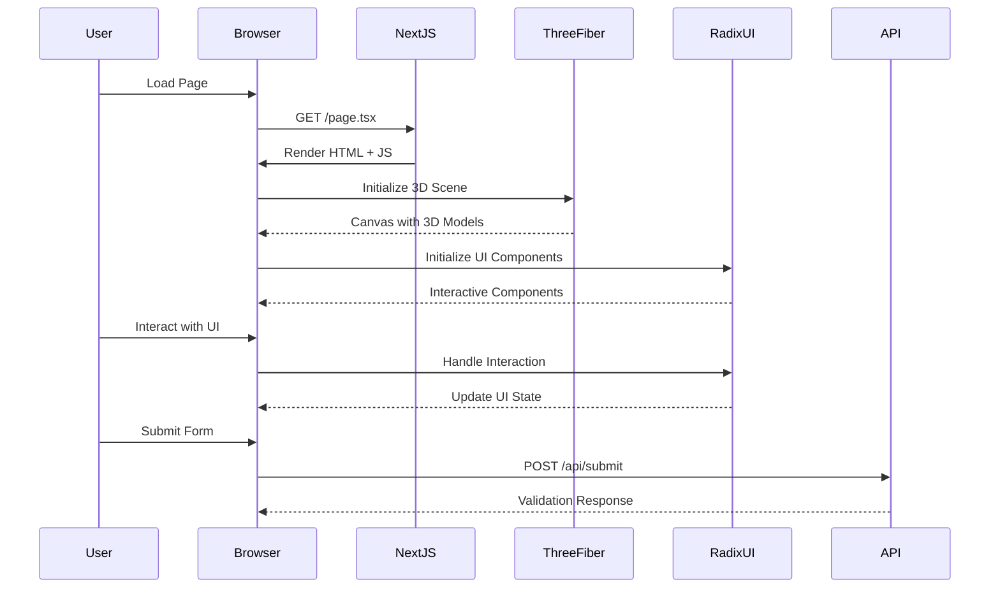

# 3D Landing Page

> A modern 3D landing page built with React Three Fiber, Next.js, and Tailwind CSS

[](https://nextjs.org/)
[](https://react.dev/)

---

## Table of Contents

- [Features](#features)
- [Tech Stack](#tech-stack)
- [Project Stats](#project-stats)
- [System Architecture](#system-architecture)
- [Getting Started](#getting-started)
- [Configuration](#configuration)
- [Scripts](#scripts)
- [Project Structure](#project-structure)

---

## Features

### Core Features

- **Interactive 3D Elements** — Immersive 3D visuals using React Three Fiber and Drei
- **Responsive Design** — Fully responsive layouts optimized for all devices
- **Modern UI Components** — Built with shadcn/ui components
- **Dark/Light Mode** — Theme support with next-themes
- **Type-Safe** — Full TypeScript support

### UI Components

- Accordion panels
- Alert dialogs
- Aspect ratio containers
- Avatar components
- Checkbox inputs
- Collapsible sections
- Context menus
- Dialog modals
- Dropdown menus
- Hover cards
- Navigation menus
- Popovers
- Progress bars
- Radio groups
- Scroll areas
- Select dropdowns
- Sliders
- Switches
- Tabs
- Toast notifications
- Toggle buttons
- Tooltips

### Advanced Features

- **Form Validation** — Using React Hook Form and Zod resolvers
- **Charts** — Data visualization with Recharts
- **Carousels** — Touch-enabled carousels with Embla
- **Date Picker** — Calendar functionality with react-day-picker
- **Command Menu** — CMDK-powered command palette
- **Input OTP** — One-time password inputs
- **Resizable Panels** — Flexible panel layouts
- **Vaul Drawers** — Drawer components

---

## Tech Stack

| Category | Technology |
|----------|-------------|
| **Framework** | Next.js 15 |
| **Language** | TypeScript |
| **UI Library** | React 19 |
| **Styling** | Tailwind CSS 3.4 |
| **3D Graphics** | React Three Fiber, Drei, Three.js |
| **UI Components** | shadcn/ui, Radix UI |
| **Forms** | React Hook Form, Zod |
| **Icons** | Lucide React |
| **Animations** | Framer Motion, Tailwind Animate |

---

## Project Stats

```
┌─────────────────────────────────────────────────────────────┐
│  Dependencies:    784 packages installed                     │
│  React Version:   19.x                                       │
│  Next.js Version: 15.2.4                                    │
│  TypeScript:      5.x                                         │
│  Tailwind CSS:    3.4.17                                       │
└─────────────────────────────────────────────────────────────┘
```

### Package Highlights

- **@react-three/fiber** — React renderer for Three.js
- **@react-three/drei** — Useful helpers for React Three Fiber
- **three** — JavaScript 3D library
- **@radix-ui/** — 15+ Radix UI primitives
- **lucide-react** — Beautiful & consistent icons
- **recharts** — Composable charting library
- **sonner** — Toast notifications
- **vaul** — Drawer components
- **cmdk** — Command menu component

---

## System Architecture

```mermaid
flowchart TB
    subgraph Client["Client Side"]
        style Client fill:#1a1a2e,color:#fff
        
        subgraph UI["UI Layer"]
            style UI fill:#16213e,color:#fff
            
            Components["shadcn/ui Components"]
            ThreeJS["React Three Fiber"]
            Pages["Next.js Pages"]
        end
        
        subgraph State["State Management"]
            style State fill:#0f3460,color:#fff
            
            Forms["React Hook Form"]
            Themes["next-themes"]
        end
        
        subgraph Data["Data Layer"]
            style Data fill:#533483,color:#fff
            
            Recharts["Chart Data"]
            API["API Calls"]
        end
    end
    
    subgraph Server["Server Side (Next.js)"]
        style Server fill:#1a1a2e,color:#fff
        
        APIRoutes["API Routes"]
        Middleware["Middleware"]
    end
    
    UI --> State
    UI --> Data
    Components --> ThreeJS
    Pages --> Components
    Themes --> UI
    Forms --> State
    Recharts --> Data
    APIRoutes --> Server
    Client --> Server
    Server --> API
end
```



---

## Getting Started

### Prerequisites

- **Node.js** 18.x or higher
- **npm** 9.x or higher

### Installation

```bash
# Clone the repository
git clone <repository-url>

# Navigate to project directory
cd 3-d-landing-page

# Install dependencies
npm install

# Start development server
npm run dev
```

### Build for Production

```bash
# Create production build
npm run build

# Start production server
npm start
```

---

## Configuration

### TypeScript Configuration (`tsconfig.json`)

```json
{
  "compilerOptions": {
    "lib": ["dom", "dom.iterable", "esnext"],
    "target": "ES6",
    "strict": true,
    "module": "esnext",
    "moduleResolution": "bundler",
    "jsx": "preserve",
    "incremental": true
  }
}
```

### Tailwind Configuration (`tailwind.config.ts`)

- **Dark Mode:** Enabled via CSS class
- **Content Paths:** `app/**`, `components/**`, `pages/**`
- **Custom Colors:** Full shadcn/ui color palette
- **Border Radius:** -lg, -md, -sm variants
- **Animations:** Accordion open/close

### Components Configuration (`components.json`)

- **Style:** Default shadcn/ui
- **RSC:** Enabled (React Server Components)
- **TSX:** TypeScript
- **Tailwind:** Config in `tailwind.config.ts`
- **CSS Variables:** Enabled
- **Icon Library:** Lucide

### Path Aliases

| Alias | Path |
|-------|------|
| `@/*` | `./` |
| `@/components` | `./components` |
| `@/components/ui` | `./components/ui` |
| `@/lib` | `./lib` |
| `@/hooks` | `./hooks` |
| `@/lib/utils` | `./lib/utils` |

---

## Scripts

| Command | Description |
|---------|-------------|
| `npm run dev` | Start development server |
| `npm run build` | Build for production |
| `npm run start` | Start production server |
| `npm run lint` | Run ESLint |

---

## Project Structure

```
3-d-landing-page/
├── app/                      # Next.js App Router
│   ├── globals.css          # Global styles
│   ├── layout.tsx         # Root layout
│   └── page.tsx          # Main page
├── components/             # React components
│   ├── ui/                # shadcn/ui components
│   └── ...
├── lib/                    # Utility functions
│   └── utils.ts           # cn() utility
├── public/                 # Static assets
├── package.json            # Dependencies
├── tsconfig.json          # TypeScript config
├── tailwind.config.ts    # Tailwind config
├── postcss.config.mjs    # PostCSS config
├── next.config.mjs       # Next.js config
└── README.md             # This file
```

---

## Deployment

### Deploy to Vercel (or any hosting provider)

1. Push to GitHub
2. Import project in your hosting provider
3. Auto-deploys on changes

---

## License

MIT License - Feel free to use this project for your own purposes.

---

## Support

- Docs: [Next.js](https://nextjs.org/) | [React Three Fiber](https://docs.pmnd.rs/) | [Tailwind CSS](https://tailwindcss.com/)